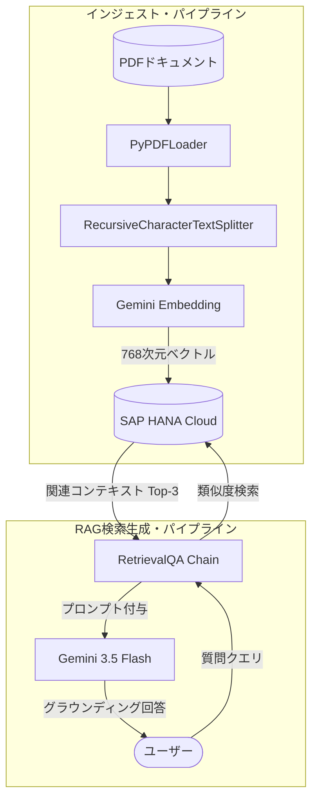

# SAP HANA Cloud Vector Engine × RAG Demo

[](https://www.python.org/)
[](https://opensource.org/licenses/MIT)

> **SAP HANA Cloud Vector Engineを用いたエンタープライズRAGシステムの実装と定量評価**

---

## 1. プロジェクト概要

本リポジトリは、SAP HANA Cloudに統合された **Vector Engine（REAL_VECTOR型）** をベクトルデータベースとして採用し、**LangChain** フレームワークおよび **Google Gemini 3.5 Flash** と連携して構築した、エンタープライズ向け文書検索（RAG: Retrieval-Augmented Generation）システムの実装デモおよび性能評価ベンチマークです。

### 本研究の背景と動機

* **初学者の学習アプローチとしての選定**: SAP BTPおよびSAP HANA Cloudの学習を開始するにあたり、最も迅速に具体的な価値（実用的なAIアプリケーション）を創出しつつ、クラウドデータベースの基本操作を包括的に学べる最初のステップとして、内蔵の「Vector Engine」を用いたRAG（検索拡張生成）システムの実装を選択しました。

* **内蔵型Vector DBの技術的価値**: 既存のSAP HANA Cloudインスタンスの機能を拡張し、追加の専用インフラストラクチャを導入することなくセキュアにRAGを実装することで、データ保護要件を満たしながらデータ分析・検索を高度化できます。

* **定量的評価の必要性**: 導入検討プロセスにおいては、概念実証（PoC）レベルではなく、既存のキーワード検索手法と比較した検索精度、応答速度（レイテンシ）、および運用コストを定量的に検証することが不可欠です。

---

## 2. システムアーキテクチャ

本システムは、PDF等のドキュメントソースをロードしてチャンク分割し、ベクトルデータを永続化する「インジェストパイプライン」と、ユーザーのクエリに基づいて関連情報を検索し回答を生成する「RAGクエリパイプライン」の2系統から構成されます。
詳細なアーキテクチャ図については [sap-hana-rag-demo/docs/architecture.md](sap-hana-rag-demo/docs/architecture.md) を参照してください。



---

## 3. クイックスタート

### 動作要件

* Python 3.11 以上
* SAP BTP / HANA Cloud Free Tier インスタンス
* Google AI Studio API Key (Gemini用)

### セットアップ手順

1. **環境構築と依存パッケージのインストール**

   ```bash
   python -m venv .venv
   source .venv/bin/activate
   pip install -r requirements.txt
   ```

2. **環境変数の設定 (`.env`)**

   プロジェクトのルートディレクトリに `.env` ファイルを作成し、各種接続情報を設定します。

   ```ini
   HANA_DB_ADDRESS=your-hana-instance.hanacloud.ondemand.com
   HANA_DB_PORT=443
   HANA_DB_USER=DBADMIN
   HANA_DB_PASSWORD=your-password
   GOOGLE_API_KEY=AIzaSy...
   ```

3. **データのロードとベクトルストアの初期化**

   `data/raw` ディレクトリに配置されたドキュメントをロードし、HANA DB上の指定テーブルへベクトルインデックスを生成します。

   ```bash
   python setup_db.py
   ```

4. **対話型デモの実行**

   ```bash
   python chat.py
   ```

---

## 4. 性能評価ベンチマーク（実験結果）

システムの検索性能を評価するため、手動で設計した評価用QAデータセット（20問）を用い、以下3種類のアプローチで検索精度、実行速度、およびAPIコストを比較しました。

* **Baseline A (BM25)**: ローカルメモリ上での分かち書きトークンを用いたキーワード検索
* **Baseline B (Vector Only)**: SAP HANA Cloud Vector Engineを使用したセマンティック検索（LLMによる回答生成なし）
* **Proposed (Vector + RAG)**: HANA Vector Engineによるセマンティック検索と、Gemini 3.5 Flashを組み合わせた回答生成

### 評価結果

| 評価指標 | Baseline A (BM25) | Baseline B (Vector Only) | Proposed (Vector + RAG) |
| :--- | :---: | :---: | :---: |
| **Hit Rate @3 (Doc)** | 55.0% (0.5500) | **70.0% (0.7000)** | **70.0% (0.7000)** |
| **Hit Rate @3 (Page)**| 15.0% (0.1500) | **20.0% (0.2000)** | **20.0% (0.2000)** |
| **MRR @3 (Doc)** | 51.67% (0.5167) | **67.50% (0.6750)** | **67.50% (0.6750)** |
| **平均レイテンシ** | **14.00 ms** | 609.24 ms | 9,511.38 ms |
| **平均コスト / クエリ**| 0 円 | 0 円 | **0.0369 円** |

* 評価比較グラフは [sap-hana-rag-demo/results/figures/](sap-hana-rag-demo/results/figures/) に出力されます。

### 実験の考察

* **検索精度の優位性**: セマンティック検索（HANA Vector Engine）を適用することにより、キーワード検索（BM25）と比較してドキュメントレベルの検索精度（Hit Rate @3）が **+15.0%pt**、検索結果の質を示すMRRスコアが **+15.8%pt** と顕著な向上が見られました。これは、表記揺れや類似の類義語が多く用いられる技術ドキュメント検索において、意味的なアプローチが強力に機能することを証明しています。
* **コストと効率性のトレードオフ**: Gemini 3.5 Flashの採用により、1クエリあたりのAPIコストを平均約 **0.037円** に抑制し、高い経済性を実現しました。一方で、検索結果をコンテキストとして与えるRAG全体の平均レイテンシは約9.5秒を記録しており、リアルタイム性が重視される本番システムへの導入にあたっては、非同期型プロセスの適用や結果のキャッシュなどの検討が必要と考えられます。
* **実務での制約事項**: 検証に用いたHANA Cloud Free Tierは毎日自動的にインスタンスが停止する制約があるため、本番環境での導入に際しては、自動起動やヘルスチェックプロセスの定義、レートリミットを考慮した指数バックオフによるリトライロジックの実装が推奨されます。

---

## 5. ディレクトリ構成

```text
sap-hana-rag-demo/
├── README.md               # プロジェクト概要・結果サマリ
├── requirements.txt        # 依存パッケージ
├── setup_db.py             # ベクトルDB初期化スクリプト
├── chat.py                 # 対話型チャット実行デモ
├── data/
│   ├── raw/                # 収集したPDFドキュメント
│   └── qa_testset.json     # 評価用QAセット (20問)
├── docs/
│   ├── architecture.md     # システム設計図 (Mermaid)
│   └── qa_sheet.md         # 評価用QAリスト詳細
├── notebooks/
│   ├── 01_ingest.ipynb     # ドキュメントロード・チャンク分割
│   ├── 02_vectorstore.ipynb# HANAへのベクトルデータ格納
│   ├── 03_rag_pipeline.ipynb# RAGチェーンの構築と個別テスト
│   └── 04_benchmark.ipynb  # 評価実験の実行
├── src/
│   ├── __init__.py
│   ├── ingest.py           # ドキュメント処理モジュール
│   ├── vectorstore.py      # HANA Vector Store 操作モジュール
│   ├── rag.py              # RAGチェーン構築モジュール
│   └── evaluate.py         # ベンチマーク評価スクリプト
└── results/
    ├── benchmark_results.csv# 評価データ詳細
    └── figures/            # 評価比較グラフ (PNG)
```

---

## 6. 参考文献

* [SAP HANA Cloud Vector Engine Guide](https://help.sap.com/docs/hana-cloud-database/sap-hana-cloud-sap-hana-database-vector-engine-guide/introduction)
* [LangChain Integration with SAP HANA](https://python.langchain.com/docs/integrations/vectorstores/sap_hanavector/)
