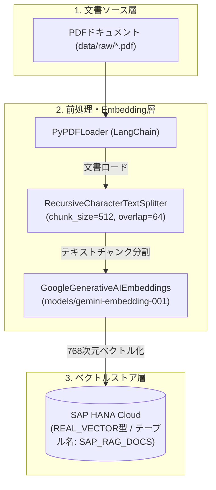
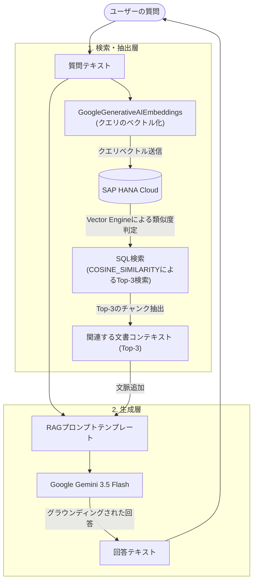

# システムアーキテクチャ設計図

本システムは、SAP HANA Cloud の Vector Engine と Google Gemini API (LangChain経由) を融合したエンタープライズ文書検索（RAG）システムです。データフローは大きく分けて「ドキュメント・インジェスト（データ蓄積）」と「RAGクエリ（検索・回答生成）」の2つで構成されます。

---

## 1. ドキュメント・インジェストフロー
ローカルのPDFドキュメント（SAPヘルプや役割定義書など）を読み込み、適切なサイズにチャンク分割したうえでベクトル化し、SAP HANA Cloud に永続化する流れです。

---

## 2. RAGクエリ（検索・回答生成）フロー
ユーザーが質問を投げてから、HANA DBによる高速なベクトル類似度検索（内蔵のCOSINE_SIMILARITY関数）を実行し、得られた関連文書をコンテキストとしてGemini LLMに与え、正確な回答を生成する流れです。

